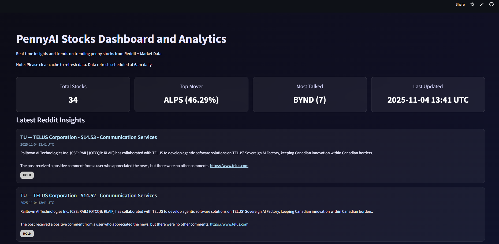

# PennyAI

**PennyAI** is an end-to-end data pipeline and analysis platform designed to help traders and investors make smarter decisions on penny stocks. It ingests Reddit posts, enriches them with market data, and provides actionable insights using AI-driven summarization.

---

## 🚀 Features

- **Automated Data Pipeline**  
  - Fetches posts from Reddit and financial data from Yahoo Finance daily.
  - Cleans, processes, and stores data in DuckDB and Parquet formats.
  - Fully automated daily ingestion using GitHub Actions.

- **AI-Powered Summarization**  
  - Leverages **LangChain** with **Groq LLM** to summarize top Reddit posts and comments.
  - Helps identify trending penny stocks and market sentiment.

- **Flexible Frontend Options**  
  - **React + Next.js** dashboard for a modern web interface.
  - **Streamlit** app for quick deployment and interactive analytics.
  
- **API Integration**  
  - Flask + Uvicorn backend exposing endpoints to serve processed data and summaries.

---

## 🗂 Project Structure

```
pennyai/
├── backend/                # Data pipeline and API backend
│   ├── data/               # Raw and processed datasets
│   ├── main.py             # Main pipeline runner
│   ├── server.py           # Flask/Uvicorn API server
│   └── scripts/            # Data ingestion & processing scripts
├── frontend/               # React + Next.js dashboard
├── streamlit-frontend/     # Streamlit alternative frontend
├── .github/workflows/      # GitHub Actions for daily ingestion
├── pyproject.toml          # Python dependencies
└── uv.lock                 # Environment lock for uv
```

---

## ⚡ Getting Started

### 1. Environment Setup

PennyAI uses **uv** for environment management.  
```bash
uv install
uv activate
```

### 2. Install Dependencies
```bash
pip install -r requirements.txt
```

### 3. API Keys Required
You need three API keys:
- **Reddit API Key 1**
- **Reddit API Key 2**
- **Groq API Key** (for LLM summarization)

### 4. Run Data Pipeline
```bash
python backend/main.py
```

### 5. Run the App

#### Streamlit (Current Deployment)
```bash
streamlit run streamlit-frontend/app.py
```

#### React + Next.js (Optional)
```bash
cd frontend
npm install
npm run dev
```

### 6. Automated Daily Ingestion
The pipeline runs automatically every day using GitHub Actions:  
`.github/workflows/daily_ingest.yml`

---

## 🔑 How It Works

1. **Reddit Ingestion:**  
   Fetches posts and comments related to penny stocks.

2. **Financial Enrichment:**  
   Enriches data with ticker info from Yahoo Finance.

3. **Processing & Storage:**  
   Processes raw data into LLM-ready datasets and stores them in DuckDB & Parquet.

4. **Summarization:**  
   Groq LLM summarizes top posts and comments for actionable insights.

5. **Dashboard:**  
   Visualizes trends, summaries, and key stock information for decision-making.

---

## 🖼 Screenshots

_Streamlit frontend screenshot_  


---

## 🛠 Tech Stack

- **Backend:** Python, Flask, Uvicorn, DuckDB, LangChain, Groq LLM  
- **Frontend:** React, Next.js, TailwindCSS or Streamlit  
- **Data Storage:** Parquet, DuckDB  
- **CI/CD:** GitHub Actions  

---

## ✨ Future Improvements

- Add real-time sentiment scoring.  
- Integrate more financial APIs for richer datasets.  
- Enhance the Next.js dashboard with interactive charts.  

---

## 👨‍💻 Author

Made with ❤️ by **Mohit Appari**  
- [LinkedIn](https://www.linkedin.com/in/moh1tt)  
- [Email](mailto:moh1tt.vercel.app)

